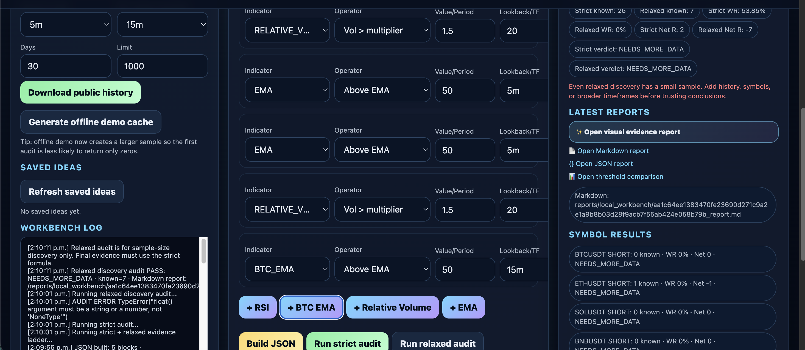
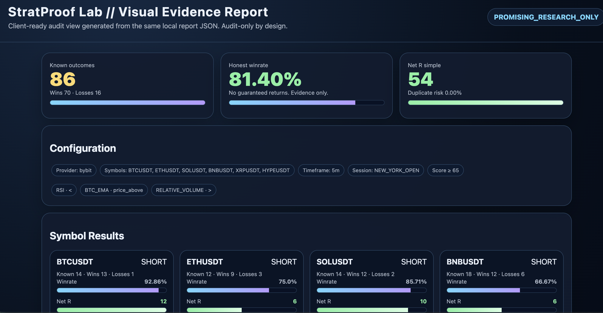
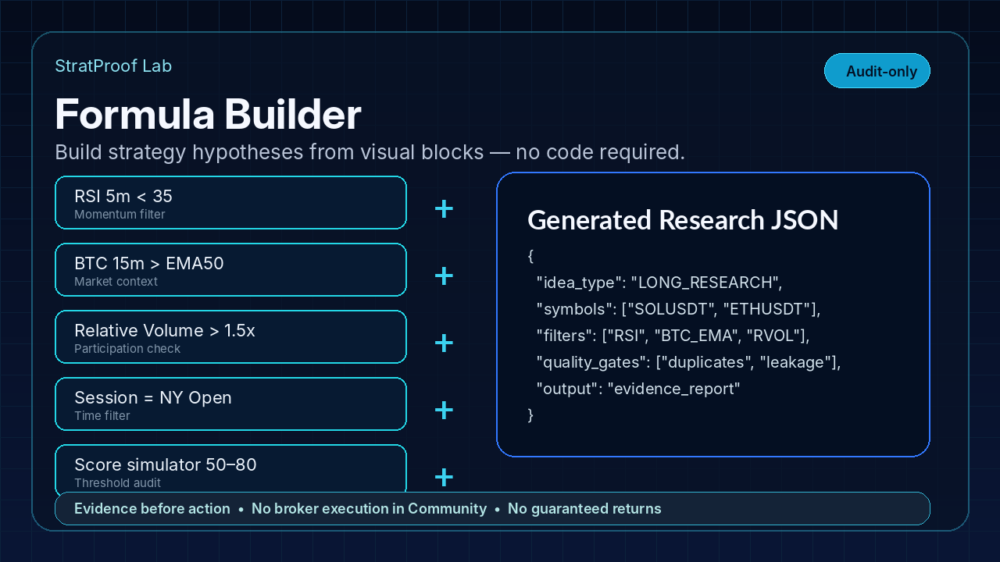
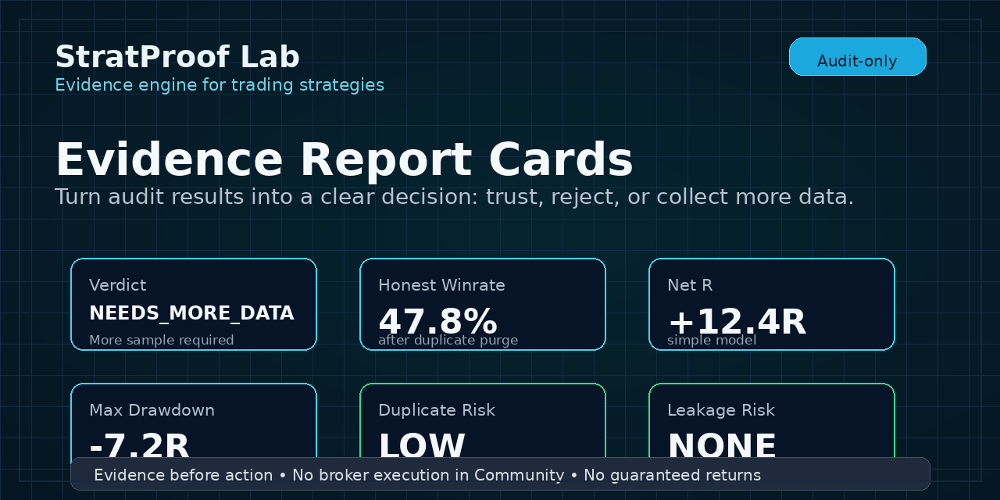
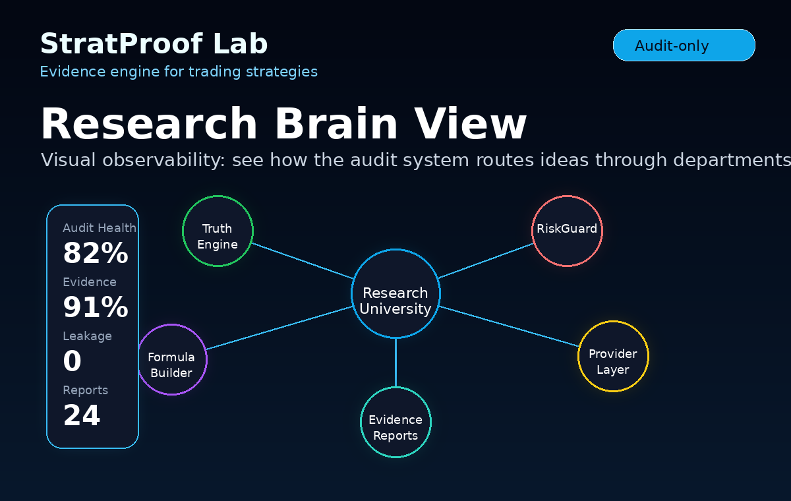
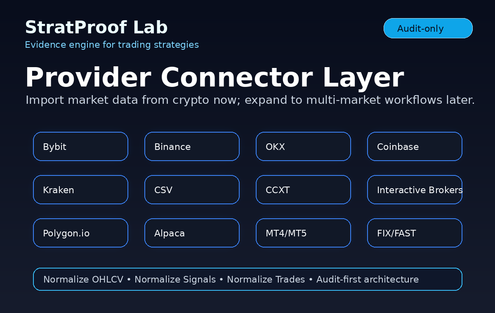

<div align="center">

# StratProof Lab

### Most trading strategies look good — until they are audited.

**StratProof Lab is an evidence engine for traders, quants, educators, and trading teams.**  
It turns strategy ideas into testable hypotheses, runs chronological audits, challenges inflated winrates, checks evidence quality, and generates reports before capital is put at risk.

**Build the idea → import data → audit the evidence → expose the weak points → generate the report.**

[Quickstart](#quickstart) · [Workbench guide](docs/STAGE48_DEMO_WORKBENCH_USER_GUIDE.md) · [Problem](#the-problem) · [Core modules](#core-modules) · [What makes it different](#what-makes-stratproof-different) · [Roadmap](#roadmap) · [Community vs Pro](#community-vs-pro)

</div>
---

## v2.0: Multi-exchange evidence, not single-venue trust

Community v2 can import completed public OHLCV candles from **Bybit, Binance, OKX, Coinbase Exchange, and Kraken**. A trader can test the same hypothesis across independent exchange sources instead of accepting one venue's history as the whole story.

The v2 integrity rules are intentionally strict:

- repeat downloads merge by candle timestamp instead of duplicating audit samples;
- OKX unconfirmed candles are rejected;
- Kraken's documented current, uncommitted final candle is rejected;
- Coinbase and Kraken are spot-only in the public Community downloader;
- every connector is audit-only and uses no API key or trading permission.

Every formula audit can now download an **Audit Trail Pack** of no more than three CSV files: a full detected-operations ledger, its supporting candle paths, and a TradingView Portfolio-compatible replay file for eligible closed `LONG` spot results. This makes the numbers inspectable while stating plainly that detections are replays, not executed trades, and labeling synthetic offline-demo inputs separately from stored market data.

See [Public connector evidence policy](docs/V2_PUBLIC_CONNECTORS.md), [Audit Trail CSV exports](docs/V2_AUDIT_EVIDENCE_EXPORTS.md), and the [v2 audit report](docs/V2_AUDIT_REPORT.md) for details.

## See the audit workflow

StratProof Lab should feel different from a normal backtester. The product story is simple: build an idea, audit the evidence, inspect the quality gates, and understand how the research system reached its verdict.


## Real Community Workbench preview

This is the actual local Workbench flow: choose provider, configure symbols and timeframes, build a formula with visual blocks, run strict vs relaxed audits, and review the evidence guidance panel.

<p align="center">
  
</p>

## Real Visual Evidence Report preview

The visual report turns an audit result into a client-ready evidence view: known outcomes, honest winrate, Net R, configuration, symbol-level results, and research-only verdicts.

<p align="center">
  
</p>






<p align="center">
  
</p>

<p align="center">
  
</p>

---

## The problem

Backtests can be beautiful and still be dangerous.

A strategy can show a high winrate because of duplicate signals, leakage, same-candle assumptions, overfitting, small samples, lucky sessions, symbol concentration, missing fees, or a market regime that no longer exists.

Most tools help you build, optimize, or deploy strategies.

**StratProof Lab asks a harder question:**

> Does this strategy have real evidence, or does it only look good in a backtest?

---

## What StratProof Lab is

StratProof Lab is an **audit-first research system** for trading strategies.

It is not designed to be another bot marketplace, signal publisher, or magic AI trader. It is designed to become the missing quality-control layer between an idea and real-world risk.

It helps you answer questions like:

- Is the winrate honest?
- Is the sample large enough?
- Did the strategy depend on duplicate clustered entries?
- Did the backtest accidentally use future information?
- Does the edge survive across symbols, sessions, timeframes, and regimes?
- What happens when the score threshold changes?
- Is Net R positive after basic risk assumptions?
- Which formulas should be rejected, watched, or researched further?

---

## Product thesis

Trading infrastructure has many builders, bots, optimizers, and execution engines.

StratProof Lab is different:

> **It is an evidence layer.**

The goal is not to make a strategy look good.  
The goal is to find out whether it deserves trust.

---

## What makes StratProof different

### 1. Audit-first, not execution-first

Many platforms focus on building or deploying strategies. StratProof focuses on evidence quality first.

Community Edition is designed around:

- importing market data,
- creating research ideas,
- running audit-only tests,
- checking weaknesses,
- generating evidence reports.

Execution is not the default product promise.

### 2. Research University workflow

A strategy idea is not treated as a finished strategy. It is treated as a hypothesis.

```text
Idea
  ↓
Hypothesis Builder
  ↓
Data Setup Department
  ↓
Chronological Audit
  ↓
Truth Engine
  ↓
Quality Gates
  ↓
Risk / Net R Review
  ↓
Evidence Report
```

### 3. Quality gates that try to break the idea

StratProof does not only calculate performance metrics. It looks for reasons not to trust the result.

Current and planned gates include:

- duplicate and clustering risk,
- leakage risk,
- weak sample warnings,
- same-candle ambiguity handling,
- symbol concentration,
- session dependency,
- regime dependency,
- score-threshold fragility,
- drawdown and Net R review.

### 4. Visual Formula Builder

Users can build ideas as blocks instead of writing strategy code first.

Example:

```text
[RSI 5m < 35]
+
[BTCUSDT 15m above EMA50]
+
[Relative Volume > 1.5x]
+
[New York Open]
+
[Score threshold simulation 50–80]
```

The output is a portable research hypothesis that can be audited.

### 5. Evidence Report Builder

The output is not only a raw backtest table. StratProof generates research cards and evidence summaries:

- verdict,
- honest winrate,
- Net R,
- max drawdown,
- duplicate risk,
- leakage risk,
- evidence score,
- truth confidence,
- threshold comparison,
- warnings and blockers.

It also exports a three-file audit trail so users can inspect each detected operation, trace the exact OHLCV path used by the replay, and visualize eligible spot replays through TradingView's documented Portfolio CSV import format.

### 6. Research Brain View

StratProof includes a visual observability screen that shows how the system routes ideas through departments, gates, connectors, and reports.

It is not the operational dashboard.  
It is a visual map of how the research system thinks.

### 7. Crypto today, multi-market tomorrow

The first public focus is crypto strategy auditing.

The architecture is designed to grow into a multi-market audit framework for:

- crypto,
- forex,
- equities,
- futures,
- options,
- custom CSV datasets,
- institutional data pipelines.

---

## Core modules

| Module | Purpose |
|---|---|
| Formula Builder UI | Build strategy ideas visually with indicator blocks. |
| Data Setup Department | Import or download market history. |
| Provider Connector Layer | Normalize data from exchanges, brokers, and CSV files. |
| Idea Lab | Convert ideas into research hypotheses. |
| Backtest Runner | Run audit-only chronological tests. |
| Multi-timeframe Context Engine | Add BTC/context filters and aligned timeframe checks. |
| Score Threshold Simulator | Compare thresholds like 50, 60, 65, 70, 75, 80. |
| Indicator Block Library | RSI, EMA, MACD, VWAP, ATR, relative volume, sessions, and more. |
| Evidence Report Builder | Convert audit results into readable evidence cards. |
| Research Brain View | Visual map of how the research system works. |
| i18n Layer | English, Spanish, Portuguese, and German interface support. |

---


## Community demo status

The local Workbench has been manually tested as a real user flow:

- download/import market data
- build a visual formula
- run strict and relaxed audits
- compare evidence in the Evidence Ladder
- open visual, Markdown, JSON, and threshold reports
- preview Pro features without enabling payments

Community is intentionally audit-only and local-first. It is usable for learning and validating the workflow, while Pro/Team editions are planned for larger-scale research workflows.


## Editions and monetization status

StratProof Lab is being released first as a **Community Edition**.

The Community Edition is free, open-source, local-first, and audit-only. It is designed to let traders, educators, developers, and researchers understand the workflow before any paid plan exists.

Paid editions are planned, but **no payment system, license server, customer database, wallet address, or checkout integration is active in this public repository**.

### What is available now

| Edition | Status | Intended use |
|---|---|---|
| Community | Available now | Local strategy-audit demo, public GitHub repo, education, experimentation. |
| Pro Early Access | Planned | Power-user workflow, larger audits, richer reports, saved research workflows. |
| Pro Plus | Planned | Advanced research, batch audits, deeper evidence gates, multi-market imports. |
| Team | Planned | Shared workspaces for trading communities, educators, and small teams. |
| Enterprise / SaaS | Planned | Private deployments, white-label reports, premium connectors, custom support. |

### Feature boundary

| Feature | Community | Pro | Pro Plus | Team / Enterprise |
|---|---:|---:|---:|---:|
| Local Workbench | ✅ | ✅ | ✅ | ✅ |
| Formula Builder | ✅ Basic | ✅ Advanced | ✅ Advanced | ✅ Advanced |
| Bybit/Binance/OKX/Coinbase/Kraken public history | ✅ Basic | ✅ Larger limits | ✅ Larger limits | ✅ Custom limits |
| Offline synthetic demo cache | ✅ | ✅ | ✅ | ✅ |
| Strict audit | ✅ | ✅ | ✅ | ✅ |
| Relaxed discovery audit | ✅ | ✅ | ✅ | ✅ |
| Visual evidence report | ✅ Basic | ✅ Enhanced | ✅ Enhanced | ✅ Branded |
| Markdown / JSON / threshold reports | ✅ | ✅ | ✅ | ✅ |
| LONG + SHORT comparison | 🔒 Pro preview | ✅ | ✅ | ✅ |
| Batch formula audit | 🔒 Pro preview | ✅ | ✅ | ✅ |
| Strategy ranking | 🔒 Pro preview | ✅ | ✅ | ✅ |
| Advanced PDF export | 🔒 Pro preview | ✅ | ✅ | ✅ Branded |
| Regime and session analysis | 🔒 Pro preview | Limited | ✅ | ✅ |
| Portfolio-level evidence | 🔒 Pro preview | Limited | ✅ | ✅ |
| Team workspaces | 🔒 Preview | — | — | ✅ |
| Premium / institutional connectors | Roadmap | Optional | Optional | ✅ |

### Planned pricing direction

These are planning targets, not active checkout links:

| Plan | Monthly target | Standard annual target | Founding annual target | Notes |
|---|---:|---:|---:|---|
| Community | Free | Free | Free | AGPL-3.0-or-later public edition. |
| Pro Early Access | $29/month | $295/year — save ~15% | $209/year — first 100 annual subscribers save ~40% | First paid power-user plan. |
| Pro Plus | $79/month | $805/year — save ~15% | $569/year — first 100 annual subscribers save ~40% | Larger research workflows and advanced gates. |
| Team | $199/month | $2,030/year — save ~15% | $1,433/year — first 100 annual subscribers save ~40% | Shared workspace for groups and educators. |
| Enterprise / SaaS | From $999/month | Custom annual contract | Custom | Private deployment, custom connectors, support. |

Annual billing direction: **monthly is flexible; annual is best value**. Standard annual plans are expected to save about 15%. A planned Founding Member offer may give the first 100 annual subscribers about 40% off while Pro is being built and validated.

Payment direction: **card-first for trust, crypto-ready for global traders**. Planned payment options may include card checkout providers such as Stripe, Lemon Squeezy, Paddle, Gumroad, or PayPal, plus optional stablecoin/crypto invoice flows for eligible customers. No wallet private keys or payment secrets belong in this repository.

Paid editions are not required to use Community. Community should remain useful on its own. The public repo has no active checkout, no license server, and no payment secrets.

## Current release

Current public release candidate: `v2.0.0-community-preview`.

StratProof Lab Community is available now as a local-first, audit-only GitHub preview. Paid editions are planned, but no checkout, wallet, license server, or payment secret is active in this repository.

## Quickstart

### 1. Install

```bash
python -m venv .venv
source .venv/bin/activate
pip install -r requirements.txt
```

### 2. Run the one-command public demo

```bash
python scripts/run_public_demo.py
```

### Open the visual demo screens

After unzipping the Community package, you can open the visual launcher directly:

```bash
open app/auditor_dashboard/index.html
```

From there you can preview the Formula Builder UI, Evidence Report Cards, and Research Brain View.


This generates synthetic market data, runs a sample Idea Lab audit, builds evidence report cards, exports support assets, and writes:

```text
reports/public_demo/DEMO_INDEX.md
```


### 2A. Run the full local workbench

For the full Community demo experience, run:

```bash
python scripts/launch_local_workbench.py
```

Then open the local URL shown in the terminal.

Recommended workbench order:

```text
1. Choose provider and symbols.
2. Choose timeframe, BTC context timeframe, days, and candle limit.
3. Click Generate offline demo cache for a quick synthetic-data workflow test.
4. Or click Download public history for real public exchange candles.
5. Build a formula with the visual blocks.
6. Click Build JSON.
7. Click Run strict audit.
8. Click Run relaxed audit or Run strict + relaxed.
9. Review Evidence Guidance and Strict vs Relaxed Evidence Ladder.
10. Open the visual evidence report, Markdown report, JSON report, or threshold comparison.
11. Save ideas worth testing again.
```

Important terminology:

```text
Generate offline demo cache
= creates synthetic local demo candles. Use it to test the UI and workflow quickly.

Download public history
= downloads real public completed candles from Bybit, Binance, OKX, Coinbase Exchange, or Kraken.
```

Read the full guide:

```text
docs/STAGE48_DEMO_WORKBENCH_USER_GUIDE.md
```


### 3. Or run the smoke test only

```bash
python tests/smoke_test_public_package.py
```

### 4. Generate demo data manually

```bash
python scripts/stage13_generate_multitimeframe_demo_cache.py \
  --symbols SOLUSDT,ETHUSDT \
  --timeframe 5m \
  --context-timeframe 15m
```

### 5. Run a demo audit manually

```bash
python scripts/stage13_run_multitimeframe_audit.py \
  examples/idea_lab/rsi_btc_volume_long_example.json \
  --project-root . \
  --thresholds 50,55,60,65,70,75,80
```

### 6. Build an evidence report manually

```bash
python scripts/stage16_build_evidence_report.py \
  examples/evidence_reports/stage16_demo_audit_summary.json \
  --out-dir reports/evidence_reports
```

---

## Open dashboard screens

The current Community package ships static dashboard screens that can be opened in a browser:

```text
app/auditor_dashboard/formula_builder_ui.html
app/auditor_dashboard/evidence_report_builder_ui.html
app/auditor_dashboard/research_brain_view.html
app/auditor_dashboard/setup_idea_lab_dashboard.html
```

---

## Supported languages

Current UI language files:

```text
English
Español
Português
Deutsch
```

The i18n layer is intentionally simple so the dashboard, reports, and future docs can expand into more languages later.

---

## Provider roadmap

Community focus:

- CSV import,
- Bybit public market data,
- Binance public market data,
- OKX public market history for spot and USDT swaps,
- Coinbase Exchange public spot candles,
- Kraken public spot OHLC with the live final candle removed from audit input,
- duplicate-safe local candle cache,
- CCXT fallback specification.

Future Pro / Enterprise roadmap:

- Interactive Brokers,
- Polygon.io,
- Alpaca,
- MT4 / MT5 imports,
- Oanda / FXCM,
- Hyperliquid,
- FIX / FAST,
- CQG,
- Rithmic,
- Trading Technologies,
- institutional data pipelines.

The principle is simple:

> Import and audit first. Execution is not the default scope.

---

## Community vs Pro

Community is available now. Pro, Pro Plus, Team, and Enterprise are planned commercial editions.

The public repo includes Pro previews only as product direction: those buttons explain the upgrade path but do not connect payments or unlock paid workflows. See the detailed matrix above and:

- `docs/PUBLIC_PRO_BOUNDARY_STAGE53.md`
- `docs/PRICING_AND_PAYMENTS_CLARITY_STAGE53.md`
- `OPEN_SOURCE_BOUNDARIES.md`
- `PREMIUM_MODULES.md`

---

## Safety model

StratProof Lab is **audit-only by design**.

It imports market data, tests strategy ideas, validates evidence, and generates reports. It does not execute trades by default.

Public safety principles:

- evidence before action,
- no broker order placement in Community,
- no withdrawal permissions,
- no managed accounts,
- no guaranteed returns,
- no financial advice.

---

## Roadmap

### Phase 1 — Community Auditor

- clean public repo,
- Formula Builder,
- Evidence Report Builder,
- Research Brain View,
- CSV import,
- public crypto data connectors,
- demo audit workflow.

### Phase 2 — Stronger audit engine

- richer indicators,
- better multi-timeframe joins,
- advanced Truth Engine checks,
- duplicate/leakage scoring,
- walk-forward reports,
- out-of-sample comparison.

### Phase 3 — Multi-market expansion

- forex imports,
- equities data,
- futures data,
- MT4/MT5 imports,
- Interactive Brokers / Polygon.io / Alpaca connectors.

### Phase 4 — Pro / SaaS

- hosted reports,
- team audit workspaces,
- private evidence vault,
- enterprise connector layer,
- branded reports,
- research API.

---

## What StratProof is not

StratProof Lab is not:

- a get-rich-quick tool,
- a signal-selling product,
- a broker,
- a managed account service,
- a financial advisor,
- a guarantee of profit.

It is a research and evidence system for people who want to test before they trust.

---

## License

Community Edition is licensed under **AGPL-3.0-or-later** with clear commercial boundaries for Pro, Enterprise, SaaS, hosted, and white-label use cases.

See:

- `LICENSE`
- `DUAL_LICENSE.md`
- `COMMERCIAL_LICENSE.md`
- `OPEN_SOURCE_BOUNDARIES.md`
- `PREMIUM_MODULES.md`
- `TRADEMARK_POLICY.md`

---

## One-line pitch

**StratProof Lab helps traders stop trusting pretty backtests and start demanding evidence.**

- `TRADEMARK_POLICY.md`
- `OPEN_SOURCE_BOUNDARIES.md`
- `PREMIUM_MODULES.md`

StratProof Lab is audit-only by design. It is not a broker, exchange, investment adviser, managed-account service, signal seller, or guaranteed-return system.


## Release status

Current package status: **v2.0 Community Preview release candidate**.

The public package includes smoke testing and safety scanning. The canonical AGPL-3.0 license text is present. Version 2.0 adds multi-exchange public candle evidence and duplicate-safe caching while retaining the audit-only boundary.


## Monetization model

StratProof Lab is designed as a community-first product with a clear commercial path.

> Card-first for trust. Crypto-ready for global traders.

Planned editions:

| Edition | Monthly | Standard annual | Founding annual | Purpose |
|---|---:|---:|---:|---|
| Community | Free | Free | Free | AGPL open-source edition for public trust and adoption |
| Pro Early Access | $29/mo | $295/yr — save ~15% | $209/yr — first 100 save ~40% | advanced reports and serious individual workflows |
| Pro Plus | $79/mo | $805/yr — save ~15% | $569/yr — first 100 save ~40% | batch audits, multi-market imports, and advanced Quality Gates |
| Team | $199/mo | $2,030/yr — save ~15% | $1,433/yr — first 100 save ~40% | shared workspaces and branded reports for groups |
| Enterprise / SaaS | from $999/mo | custom | custom | private deployments, premium connectors, and white-label workflows |

StratProof Lab does not sell guaranteed returns, managed accounts, or magic signals. It sells evidence, workflow, audit quality, and reporting infrastructure.

Planned annual incentive:

- Standard annual billing: about 15% off vs. paying monthly.
- Founding Member offer: first 100 annual subscribers may receive about 40% off.
- No active checkout is included in this repository; these are public planning targets, not active payment links.

---

## v2.0.0 Community Preview

StratProof Lab v2 is a multi-exchange Community Preview release candidate. It includes a one-command demo, five implemented public candle connectors, data-integrity safeguards, visual GitHub assets, tests, issue templates, and AGPL licensing.


## Community vs Pro preview

The Community workbench is intentionally useful: build one formula, audit one side, compare strict vs relaxed evidence, and generate visual reports locally.

Some advanced workflows appear as locked Pro previews so users can understand the product path without payments enabled:

- LONG + SHORT comparison
- batch formula audits
- advanced PDF export
- regime/session analysis
- portfolio evidence
- team workspace

These previews do not connect payments, license keys, broker execution, or live trading.
