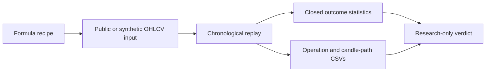

<div align="center">

# StratProof Lab

### Most trading strategies look good until they are audited.

**An open-source evidence workbench for testing crypto trading hypotheses before risking capital.**

Build an idea -> load public candles -> run a chronological replay -> download the evidence behind the result.

**[Launch the live interactive demo](https://stratproof-43-157-95-145.nip.io/)**<br>
Synthetic evidence only in the hosted demo. No broker execution.

[Live Demo](https://stratproof-43-157-95-145.nip.io/) | [Quickstart](#quickstart) | [What Works Today](#what-works-today) | [Audit Trail](#audit-trail) | [Limits](#current-limits) | [Roadmap](#roadmap) | [Contributing](#contributing)

</div>

---

## Why StratProof

Trading tools are excellent at building strategies, optimizing parameters and eventually deploying bots. StratProof focuses on the uncomfortable step in between:

> Does this idea have evidence worth investigating, or does it only produce a convincing backtest headline?

StratProof Lab is audit-only by design. It does not place orders, publish signals, hold funds, or promise performance.

## What Works Today

Community v2 is a usable local application, not a mockup:

- Visual formula recipes for `LONG` or `SHORT` research using RSI, EMA, BTC EMA context, relative volume, sessions and score thresholds.
- Completed public OHLCV candle downloads from **Bybit, Binance, OKX, Coinbase Exchange and Kraken**.
- Duplicate-safe local storage: overlapping downloads merge by timestamp rather than inflating the sample.
- Completed-candle controls: OKX unconfirmed candles and Kraken's current uncommitted candle are excluded from audit input.
- Chronological TP/SL replay with conservative same-candle ambiguity handling.
- Closed-outcome winrate, simple Net R, simple drawdown, duplicate rate, symbol summaries and threshold comparison.
- Strict audit and relaxed discovery paths, with the relaxed result explicitly kept out of promotion claims.
- Visual, Markdown and JSON reports.
- Unrestricted CSV evidence downloads in the open-source Community workbench.

Coinbase Exchange and Kraken downloads are spot-only. Public feeds remain subject to regional availability, rate limits, available instruments and historical depth.

## Evidence Command Center

The Workbench uses a compact first-user path:

```text
Choose evidence -> choose a formula recipe -> run audit -> download evidence
```

Technical inputs are still available through expandable controls for assets, provider/timeframe selection, formula rules, sessions, thresholds and portable JSON.

<p align="center">
  
</p>

## Audit Trail

Every formula audit prepares three complementary evidence artifacts, with unrestricted downloads:

| File | What it proves |
|---|---|
| Detected operations ledger CSV | Each historical replay detection, condition trace, prices and outcome. |
| Source candle path CSV | The OHLCV candles used from entry through exit or replay horizon. |
| TradingView Portfolio replay CSV | Eligible closed `LONG` spot replay events for visual inspection in TradingView. |

TradingView is a visual cross-check only. Importing replay events does not rerun the formula, validate condition logic independently or prove account execution.

See [Audit Trail CSV exports](docs/V2_AUDIT_EVIDENCE_EXPORTS.md) and [public connector evidence policy](docs/V2_PUBLIC_CONNECTORS.md).

## Visual Evidence Report

The generated report surfaces results that are currently calculated by the engine: closed outcomes, winrate, Net R simple, drawdown, duplicate rate, configuration, per-symbol summaries and research-only verdicts.

<p align="center">
  
</p>

## Current Limits

Honesty is part of the product. The current Community auditor **does not yet calculate**:

- commissions, exchange fees, spreads, slippage or funding sensitivity;
- leakage/lookahead risk scoring;
- out-of-sample or walk-forward validation;
- portfolio overlap or concentration diagnostics;
- imports of external TradingView, Freqtrade or generic trade ledgers;
- reliable evidence scores or truth-confidence percentages.

These are research gaps, not hidden paid features and not implied by existing reports. A promising result remains a hypothesis for further investigation, never a trading recommendation.

## Quickstart

### Install

```bash
python -m venv .venv
source .venv/bin/activate
pip install -r requirements.txt
```

### Run the interactive Workbench

```bash
python scripts/launch_local_workbench.py
```

Fastest useful paths:

```text
1. Click Try synthetic demo + audit to understand the workflow with labeled synthetic data.
2. Or choose a supported provider, click Load public candles, select a recipe and run the audit.
3. Download the operations ledger and source candle path to inspect the result.
4. For eligible spot replays, import the TradingView CSV as a visual cross-check.
```

Read the [Workbench user guide](docs/STAGE48_DEMO_WORKBENCH_USER_GUIDE.md).

### Host a public interactive demo

```bash
STRATPROOF_PUBLIC_DEMO=1 \
STRATPROOF_PUBLIC_RUNTIME_ROOT=/tmp/stratproof-public-demo \
STRATPROOF_WORKBENCH_PORT=8771 \
STRATPROOF_NO_BROWSER=1 \
python scripts/launch_local_workbench.py
```

Hosted mode is deliberately synthetic-only: visitors can build formulas, execute labeled demo audits, inspect reports and download CSV evidence, while saved ideas and server-side public-feed downloads remain disabled. Local installs retain the full Community connector workflow.

See [hosted public demo deployment](docs/HOSTED_PUBLIC_DEMO.md).

### Run the synthetic public demo

```bash
python scripts/run_public_demo.py
```

### Run tests

```bash
python -m unittest discover -s tests -p 'test_*.py' -v
python scripts/stage28_release_preflight.py
```

## How The Audit Works



The synthetic demo is explicitly labeled and is useful only for learning the workflow. Public candle inputs are stored with source information and a dataset fingerprint so the resulting evidence can be inspected.

## Core Modules

| Module | Available behavior |
|---|---|
| Evidence Command Center | Compact local workflow for data, formulas, audits and exports. |
| Provider Connectors | Bybit, Binance, OKX, Coinbase Exchange and Kraken public historical candles. |
| Formula Builder | Visual recipe and advanced rule editing for current indicator blocks. |
| Backtest Runner | Chronological research replay with TP/SL and ambiguity handling. |
| Threshold Simulator | Compare score thresholds as exploratory analysis. |
| Evidence Export | Operations, candle-path and compatible TradingView replay CSVs. |
| Reports | Visual, Markdown and JSON audit output. |

## Roadmap

The next work should improve confidence, not add hype:

1. **External Trade Import Center**: accept TradingView, Freqtrade and generic trade-ledger CSV exports for independent auditing.
2. **Cost Reality Lab**: evaluate fees, spread, slippage and funding sensitivity.
3. **Robustness Report**: holdout and walk-forward validation, plus parameter sensitivity.
4. **Quality Diagnostics**: measured leakage/lookahead checks and portfolio concentration analysis.
5. **Reproducible case studies**: public examples where apparently attractive formulas fail or survive stronger review.

Additional assets and markets should come after these gates are trustworthy.

## Future Sustainability

StratProof Lab is free and open-source today. If the community finds it useful, the project may later support optional hosted services, private deployments or professional support. There are no paid plans, checkout flows, feature locks or usage quotas in the current Community release.

## Safety

- Audit-only by design.
- No broker order placement.
- No withdrawal permissions or custody.
- No managed accounts.
- No guaranteed returns or promised performance.
- No financial advice.

## License

The Community Edition is licensed under **AGPL-3.0-or-later**. Organizations that cannot comply with AGPL obligations may discuss a separate commercial license in the future; no commercial product is currently offered in this repository.

See [LICENSE](LICENSE), [DUAL_LICENSE.md](DUAL_LICENSE.md), [OPEN_SOURCE_BOUNDARIES.md](OPEN_SOURCE_BOUNDARIES.md) and [TRADEMARK_POLICY.md](TRADEMARK_POLICY.md).

## Contributing

Contributions are particularly valuable for:

- public connector reliability and tests;
- trade-ledger import formats;
- realistic cost modeling;
- walk-forward and out-of-sample validation;
- documentation and reproducible case studies.

Read [CONTRIBUTING.md](CONTRIBUTING.md), open an issue or start a discussion before substantial feature work.

---

**StratProof Lab helps traders stop trusting pretty backtests and start demanding inspectable evidence.**
